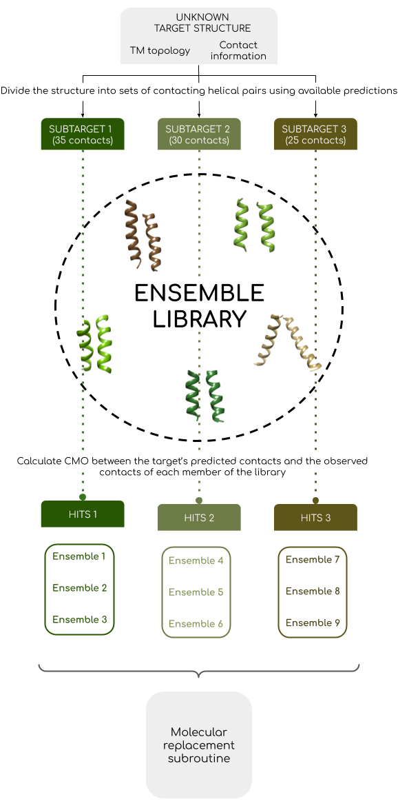

**********************************************************************
Solving structures With Alpha helical Membrane Pairs
**********************************************************************

About SWAMP
+++++++++++

SWAMP is an unconventional molecular replacement pipeline developed by the `Rigden <https://github.com/rigdenlab>`_ group at the University of Liverpool that exploits covariance information to determine the most suitable search models. SWAMP includes a library of ensembles built by clustering commonly observed folds of transmembrane helical pairs in close contact, mined from the `PDBTM <http://pdbtm.enzim.hu/>`_. It has been observed that there can be a high structural similarity between such small search models and an unknown structure, even when the search model comes from unrelated structures, which makes SWAMP ideal for those cases where no homolog information is available.

This pipeline has been developed with the following user cases in mind:

* All-α or mostly α transmembrane proteins.
* There are no suitable homolog structures in the `PDB <https://www.rcsb.org/>`_ that can be used as search models.
* Available transmembrane topology and covariance predictions, with the presence of pairs of contacting transmembrane α-helices in the unknown structure.

Several tools can be found on-line to easily obtain accurate `transmembrane topology <http://topcons.cbr.su.se/>`_ and `residue contact <http://raptorx.uchicago.edu/ContactMap/>`_ predictions.

How does it work?
+++++++++++++++++

SWAMP pipeline is divided into three steps.

1. SWAMP will process the target's transmembrane topology and residue contact predictions to split the structure into subtargets, each formed by residues predicted to constitute a contacting transmembrane helical pair.

2. For each of these subtargets, SWAMP will use the predicted interhelical contacts to scan its library of ensembles, searching for a matching pattern of contacts. The contact maximum overlap (CMO) between the target's predicted contacts and the observed contacts of the members of the library is used to assess the likeliness to solve the structure using each search model.

3. Finally, SWAMP will take those ensembles with the highest CMO into a molecular replacement subroutine. If possible, SWAMP will also try to combine and place multiple search models if these are found to have a high CMO across subtargets.

Depiction of SWAMP flowchart:

Do you want to know more?
+++++++++++++++++++++++++

Are you interested in running SWAMP and you want to know more about how to install it and use it? Read all about it `here <https://swamp.readthedocs.io/en/latest/>`_.
